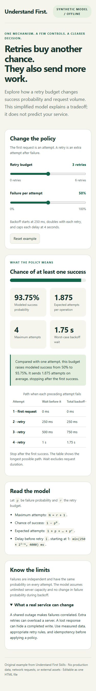

<div align="center">
  
  <p>
    <a href="LICENSE"></a>
    <a href="skills/understand-first/SKILL.md"></a>
    <a href="https://github.com/nehSgnaiL/understand-first-skills/actions/workflows/validate.yml"></a>
    <a href="README_ZH.md"></a>
  </p>
  <p><a href="#quick-start">Quick start</a> · <a href="#install">Install</a> · <a href="#skill-index">Skill index</a> · <a href="examples/README.md">Examples</a> · <a href="README_ZH.md">中文</a></p>
</div>

**Understand First** helps AI explain its work clearly, so developers can understand it and decide what to do next.

**AI-generated:** This repository's content was generated by AI from a human-provided brief.

Inspired by [Andrej Karpathy's post about understanding language-model outputs](https://x.com/karpathy/status/2105819303471976479). Independent project; no affiliation or endorsement.

## Philosophy

**Make the human able to explain the mechanism and check the evidence.**

- Start with the developer's question and the relevant behavior.
- Ground claims in inspected code, logs, diffs, data, or primary sources.
- Choose the medium that exposes the mechanism. A short answer can be the right artifact.
- Make assumptions and unknowns visible, especially in simulations.
- Keep explainers editable and inexpensive to discard.
- Continue the authorized task. Explanations support delivery and review.

The post's progression from writing to diagrams, web pages, and videos provides a set of possibilities. This project turns that idea into practical guidance; it does not require every answer to climb a format ladder.

## Quick start

Install the skill, then ask your agent:

```text
Use $understand-first to explain this change so I can review it.
Start with the behavior, show the mechanism in the most useful format,
and point to the evidence and anything still unverified.
```

| What you need | Example prompt |
| --- | --- |
| A readable change handoff | “Explain this diff in relaxed STE-inspired English. Preserve the conditions and exceptions.” |
| An architecture mental model | “Draw how one request moves through this code. Include the failure branch and source pointers.” |
| A concrete debugging explanation | “Use these logs and code to explain the timeout. Separate observations from hypotheses.” |
| An interactive comparison | “Make a local HTML explainer for these retry settings. Show how the inputs affect behavior and label assumptions.” |
| A paced explanation | “Create a short video of this state machine. Use captions if narration is unavailable. Deliver editable source too.” |

See [the worked examples](examples/README.md). Open [the offline HTML demo](examples/retry-explainer.html) locally to explore a synthetic retry model. It needs no server, account, or API key.

<details>
  <summary>Preview the interactive explainer</summary>
  <p></p>
</details>

## Install

### With the open skills CLI

With Node.js and npm available, use the [open agent skills CLI](https://github.com/vercel-labs/skills):

```bash
npx skills add nehSgnaiL/understand-first-skills --list
npx skills add nehSgnaiL/understand-first-skills --skill understand-first --agent codex --copy
```

The second command installs to the current project. Add `--global` for use across projects. For Claude Code, use `--agent claude-code`; for another supported agent, select it using the CLI. The CLI manages skill files, not video or narration runtimes.

### Manual installation or inspection

```bash
git clone https://github.com/nehSgnaiL/understand-first-skills.git
```

Copy the entire `skills/understand-first/` directory into your agent's supported skills directory. Keep `references/` and `agents/` beside `SKILL.md`. Follow your host's discovery rules; the [official Codex skill guide](https://learn.chatgpt.com/docs/build-skills) describes its skill format and loading behavior.

You can also ask an agent with file access to read `skills/understand-first/SKILL.md` directly. This does not install the skill or guarantee automatic discovery. Review any skill before adding it to your agent.

## Skill index

One installable skill keeps the common collaboration workflow in one place. Four focused references are loaded only when their mode is useful.

| Skill | Purpose | Entry point |
| --- | --- | --- |
| `understand-first` | Help a developer understand and review agent work through the right medium | [SKILL.md](skills/understand-first/SKILL.md) |

| Mode | Best for | Guidance |
| --- | --- | --- |
| Clear writing | Outcomes, procedures, handoffs | [Writing guide](skills/understand-first/references/clear-writing.md) |
| Diagrams | Relationships, boundaries, control flow | [Diagram guide](skills/understand-first/references/diagrams.md) |
| Interactive HTML | Changing inputs, comparisons, tradeoffs | [HTML guide](skills/understand-first/references/interactive-html.md) |
| Video explainers | Processes over time, paced visual reasoning | [Video guide](skills/understand-first/references/video-explainers.md) |

The skill has no mandatory runtime or external service dependency. Rich outputs depend on the tools available to the agent. The repository contains an HTML example and video guidance, not a bundled video renderer or generated video.

## Repository layout

```text
skills/understand-first/
  SKILL.md                  # Shared workflow and format selection
  agents/openai.yaml        # Display metadata and example invocation
  references/               # Writing, diagrams, HTML, video
assets/banner.svg           # Original repository artwork
examples/                   # Prompts and an offline HTML explainer
docs/evaluation.md          # Behavioral evaluation scenarios
scripts/validate.py         # Skill metadata and local-link checks
.github/workflows/          # Validation on pushes and pull requests
```

## Contribute and verify

Keep instructions focused on decisions that improve developer understanding. Prefer a correction backed by an observed failure over a universal rule for every possible task. Read [the contribution guide](CONTRIBUTING.md) and [evaluation scenarios](docs/evaluation.md).

For structural checks, use Python 3.10 or newer:

```bash
python -m pip install -r requirements-dev.txt
python scripts/validate.py
```

The validator checks skill frontmatter, display metadata, and local Markdown links. It does not prove an agent followed the skill, a technical claim is true, or an artifact is usable. Evaluate behavior with real tasks and inspect generated outputs.

## Sources and license

- **Inspiration:** [Karpathy's linked post](https://x.com/karpathy/status/2105819303471976479). The initial guidance was developed from the post text supplied by the project requester; direct retrieval of X was unavailable during creation. The skill is this project's interpretation, not the author's instructions verbatim.
- **Writing background:** [ASD-STE100 official site](https://www.asd-ste100.org/) and [FAQ](https://www.asd-ste100.org/STE_faq.html). The relaxed style is STE-inspired. No controlled dictionary or standard is redistributed, and no compliance certification is claimed.
- **Packaging:** [Official skill guidance](https://learn.chatgpt.com/docs/build-skills) and [the open skills CLI](https://github.com/vercel-labs/skills).

Original repository content is released under the [MIT License](LICENSE). Linked sources remain the property of their respective owners.
