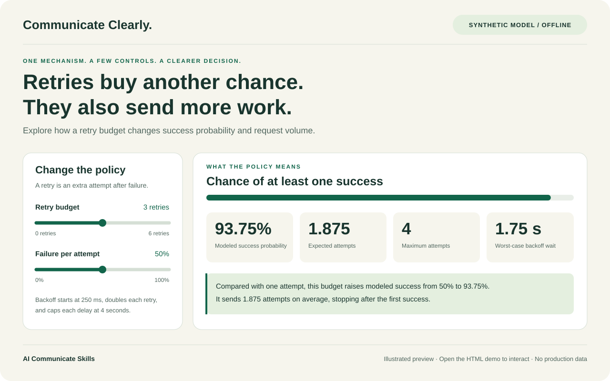

# AI-facing guide

Use this document for installation, updates, repository maintenance, and verification. The human-facing introductions are [English](README.md) and [中文](README_ZH.md).

Repository: `nehSgnaiL/ai-communicate-skills`. Installable skill: `communicate-clearly`.

For an explanation task, read [the skill entry point](skills/communicate-clearly/SKILL.md), then only the reference needed for the selected format. Match the user's language and level of detail. Ground claims in inspected evidence and continue the authorized task.

For an installation request, identify the user's target agent and install into the requested scope; use project scope when the request says “this project.” The commands below illustrate Codex. For an update request, distinguish the read-only check from applying an update. This document does not authorize unrelated configuration changes or external actions.

## Install

### With the open skills CLI

With Node.js and npm available, use the [open agent skills CLI](https://github.com/vercel-labs/skills):

```bash
npx skills@latest add nehSgnaiL/ai-communicate-skills --list
npx skills@latest add nehSgnaiL/ai-communicate-skills --skill communicate-clearly --agent codex --copy
```

The second command installs to the current project. Add `--global` for use across projects. For Claude Code, use `--agent claude-code`; for another supported agent, select it using the CLI. The CLI manages skill files, not video or narration runtimes.

### Manual installation or inspection

```bash
git clone https://github.com/nehSgnaiL/ai-communicate-skills.git
```

Copy the entire `skills/communicate-clearly/` directory into your agent's supported skills directory. Keep `references/` and `agents/` beside `SKILL.md`. Follow your host's discovery rules; the [official Codex skill guide](https://learn.chatgpt.com/docs/build-skills) describes its skill format and loading behavior.

You can also ask an agent with file access to read `skills/communicate-clearly/SKILL.md` directly. This does not install the skill or guarantee automatic discovery. Review any skill before adding it to your agent.

### Check and apply updates

For a read-only check, run the bundled script from your installed skill folder (Node.js 22 or newer):

```bash
node .agents/skills/communicate-clearly/scripts/check-updates.mjs
```

For a global Codex installation, use `~/.codex/skills/communicate-clearly/scripts/check-updates.mjs` instead. The script compares all skill files with GitHub `main`, prints differing paths, and changes nothing. Exit codes are `0` for a match, `1` for differences, and `2` if the check failed. Differences can come from upstream changes or your local edits; review customizations before updating. This optional checker uses GitHub's public API. If access is denied or rate limited, it tries an installed, authenticated GitHub CLI (`gh api`) without reading or printing credentials.

Apply an update from the project where you installed the skill:

```bash
npx skills@latest update communicate-clearly --project
# For a global installation:
npx skills@latest update communicate-clearly --global
```

The [skills CLI](https://github.com/vercel-labs/skills#skills-update) tracks the source and content hash. Project installations generate `skills-lock.json`; commit that generated file with your project's installed skills. Global installations keep their lock in the CLI's user state. Manual copies do not create CLI tracking; reinstall through the CLI or copy the updated folder yourself. The current CLI combines checking and updating in `update`; the bundled script provides a separate read-only check.

If you installed the old `understand-first` skill, install `communicate-clearly` using the command above, then remove the old installation with `npx skills@latest remove understand-first --agent codex` (add `--global` for a global copy).

## Skill index

One installable skill keeps the common collaboration workflow in one place. Four focused references are loaded only when their mode is useful.

| Skill | Purpose | Entry point |
| --- | --- | --- |
| `communicate-clearly` | Help a developer understand and review agent work through the right medium | [SKILL.md](skills/communicate-clearly/SKILL.md) |

| Mode | Best for | Guidance |
| --- | --- | --- |
| Clear writing | Outcomes, procedures, handoffs | [Writing guide](skills/communicate-clearly/references/clear-writing.md) |
| Diagrams | Relationships, boundaries, control flow | [Diagram guide](skills/communicate-clearly/references/diagrams.md) |
| Interactive HTML | Changing inputs, comparisons, tradeoffs | [HTML guide](skills/communicate-clearly/references/interactive-html.md) |
| Video explainers | Processes over time, paced visual reasoning | [Video guide](skills/communicate-clearly/references/video-explainers.md) |

The skill has no mandatory runtime or external service dependency. Rich outputs depend on the tools available to the agent. The repository contains an HTML example and video guidance, not a bundled video renderer or generated video.

## Repository layout

The offline [HTML demo](examples/retry-explainer.html) is accompanied by an editable illustration, not a browser screenshot:



```text
skills/communicate-clearly/
  SKILL.md                  # Shared workflow and format selection
  agents/openai.yaml        # Display metadata and example invocation
  references/               # Writing, diagrams, HTML, video
  scripts/check-updates.mjs  # Optional read-only upstream comparison
assets/banner.svg           # Original repository artwork
assets/retry-explainer.svg   # Editable illustrated demo preview
examples/                   # Prompts and an offline HTML explainer
docs/evaluation.md          # Behavioral evaluation scenarios
scripts/validate.py         # Skill metadata and local-link checks
package.json                # Repository tooling and npm commands
package-lock.json           # Locked skills CLI and tooling dependencies
.github/workflows/          # Validation on pushes and pull requests
```

## Contribute and verify

Keep instructions focused on decisions that improve developer understanding. Prefer a correction backed by an observed failure over a universal rule for every possible task. Read [the contribution guide](CONTRIBUTING.md) and [evaluation scenarios](docs/evaluation.md).

For structural checks, use Python 3.10 or newer:

```bash
python -m pip install -r requirements-dev.txt
python scripts/validate.py
npm ci
npm test
```

The validator checks skill frontmatter, display metadata, and local Markdown links. It does not prove an agent followed the skill, a technical claim is true, or an artifact is usable. Evaluate behavior with real tasks and inspect generated outputs.

`npm ci` installs the CLI version pinned in `package-lock.json`; `npm run check:updates` runs the read-only comparison from this checkout. Dependabot checks npm, Python, and GitHub Actions dependencies weekly and proposes updates as pull requests. `skills-lock.json` belongs to projects that consume skills; this source repository does not install itself.

## Sources and license

- **Inspiration:** [Karpathy's linked post](https://x.com/karpathy/status/2105819303471976479). The initial guidance was developed from the post text supplied by the project requester; direct retrieval of X was unavailable during creation. The skill is this project's interpretation, not the author's instructions verbatim.
- **Writing background:** [ASD-STE100 official site](https://www.asd-ste100.org/) and [FAQ](https://www.asd-ste100.org/STE_faq.html). The relaxed style is STE-inspired. No controlled dictionary or standard is redistributed, and no compliance certification is claimed.
- **Packaging:** [Official skill guidance](https://learn.chatgpt.com/docs/build-skills) and [the open skills CLI](https://github.com/vercel-labs/skills).

Original repository content is released under the [MIT License](LICENSE). Linked sources remain the property of their respective owners.
