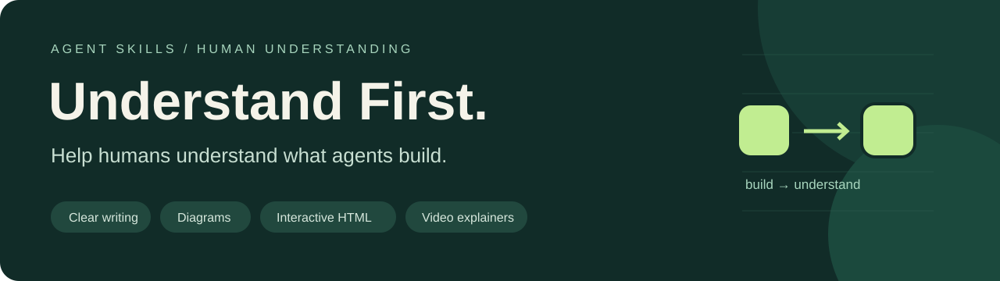

<div align="center">
  
  <p><a href="LICENSE">MIT 开源</a> · <a href="README.md">English</a> · <a href="skills/communicate-clearly/SKILL.md">技能入口</a> · <a href="examples/README.md">示例</a></p>
</div>

# AI Communicate Skills

**AI Communicate Skills** 提供 **Communicate Clearly** 技能，让 AI 把工作讲清楚，帮助开发者理解并做出判断。

**AI 生成说明：** 本仓库内容由 AI 根据人类提供的需求生成(含人量:0%)。

项目受到 [Andrej Karpathy 关于理解语言模型输出的帖子](https://x.com/karpathy/status/2105819303471976479) 启发。它是独立项目，不代表作者的产品、指令或认可。

## 核心理念

**让开发者能够讲清机制、核查证据。**

- 先说明具体行为和结论，再给必要的实现细节。
- 根据实际代码、日志、差异、数据或一手资料解释。
- 用适合问题的表达形式；简单问题用简短回答就够。
- 明确区分事实、推断、方案和未知信息。
- 保留可编辑的讲解产物，方便修改和丢弃。
- 继续完成已授权的工作，让讲解服务于交付和审查。

文字、图解、网页、视频是可选择的表达方式，不是每次都必须完成的升级流程。

## 快速开始

安装后，可以直接这样说：

```text
使用 $communicate-clearly 帮我理解这次改动，便于审查。
先说明行为变化，再用合适的表达方式解释机制。
给出可核查的依据，并标明尚未验证的部分。
```

| 需求 | 提示词示例 |
| --- | --- |
| 看懂代码改动 | “用清楚、简洁的中文解释这个 diff，保留条件和例外。” |
| 理解系统结构 | “画出一次请求的流向，包括失败分支和对应代码位置。” |
| 理解故障原因 | “结合这些日志和代码解释超时，区分观察事实和假设。” |
| 比较参数影响 | “做一个本地 HTML 讲解页，让我调整重试参数，并标明模型假设。” |
| 理解状态变化 | “生成状态机的视频讲解；没有配音时用字幕，同时交付可编辑源文件。” |

[离线 HTML 示例](examples/retry-explainer.html) 演示重试次数对成功概率、请求量和等待时间的影响。下载后用浏览器打开即可，无需服务器、账号或 API 密钥。示例采用合成模型，不是生产数据。

<details>
  <summary>查看讲解页示意预览</summary>
  <p></p>
  <p>这是可编辑的 SVG 示意图；实际交互控件请打开 HTML 示例。</p>
</details>


## 安装

已安装 Node.js 和 npm 时，可通过 [开放技能 CLI](https://github.com/vercel-labs/skills) 安装：

```bash
npx skills@latest add nehSgnaiL/ai-communicate-skills --list
npx skills@latest add nehSgnaiL/ai-communicate-skills --skill communicate-clearly --agent codex --copy
```

默认安装到当前项目；跨项目使用时添加 `--global`。Claude Code 使用 `--agent claude-code`，其他受支持的智能体可通过 CLI 选择。安装技能文件不会自动安装视频或配音工具。

手动安装时，先克隆仓库，再把完整的 `skills/communicate-clearly/` 目录复制到目标智能体支持的技能目录，保留 `references/` 和 `agents/`。[Codex 官方技能文档](https://learn.chatgpt.com/docs/build-skills) 说明了技能格式和加载规则。

```bash
git clone https://github.com/nehSgnaiL/ai-communicate-skills.git
```

也可以让有文件访问权限的智能体直接读取 `SKILL.md`，但这不等于安装或自动发现。安装前请先阅读技能内容。

### 检查与应用更新

只读检查需要 Node.js 22 或更新版本。在安装技能的项目中运行：

```bash
node .agents/skills/communicate-clearly/scripts/check-updates.mjs
```

全局 Codex 安装请改用 `~/.codex/skills/communicate-clearly/scripts/check-updates.mjs`。脚本比较本地技能文件与 GitHub `main`，列出差异，不修改文件。退出码：`0` 表示一致，`1` 表示有差异，`2` 表示检查失败。差异可能来自上游更新或本地修改，更新前请检查自己的定制。该可选脚本使用 GitHub 公共 API；遇到访问拒绝或速率限制时，尝试通过已安装并登录的 GitHub CLI (`gh api`) 查询，不读取或输出凭据。

在安装技能的项目中应用更新：

```bash
npx skills@latest update communicate-clearly --project
# 全局安装：
npx skills@latest update communicate-clearly --global
```

[skills CLI](https://github.com/vercel-labs/skills#skills-update) 记录来源和内容哈希。项目安装自动生成 `skills-lock.json`，请将其与已安装技能一起提交到使用技能的项目；全局安装的锁文件保存在 CLI 用户状态目录。手动复制不会建立 CLI 跟踪，可通过 CLI 重新安装或自行复制更新后的文件夹。当前 CLI 的 `update` 合并检查与更新，只读检查使用上面的脚本。

如果之前安装了 `understand-first`，先按上面的命令安装 `communicate-clearly`，再运行 `npx skills@latest remove understand-first --agent codex` 移除旧安装；全局安装加 `--global`。

## 技能索引

只有一个可安装技能：[`communicate-clearly`](skills/communicate-clearly/SKILL.md)。它负责协作流程和表达形式选择，并按需读取以下指南：

| 模式 | 适用问题 | 指南 |
| --- | --- | --- |
| 清晰文字 | 结论、操作、改动交接 | [文字](skills/communicate-clearly/references/clear-writing.md) |
| 图解 | 关系、边界、控制流 | [图解](skills/communicate-clearly/references/diagrams.md) |
| 交互式 HTML | 参数变化、方案比较 | [HTML](skills/communicate-clearly/references/interactive-html.md) |
| 视频讲解 | 时间过程、逐步视觉推理 | [视频](skills/communicate-clearly/references/video-explainers.md) |

技能没有必需的外部服务或运行时依赖。丰富产物取决于智能体现有工具。仓库提供 HTML 示例与视频制作指导，没有内置视频渲染器，也没有预生成的视频。

## 贡献与验证

参见[贡献指南](CONTRIBUTING.md)与[行为评估场景](docs/evaluation.md)。结构检查需要 Python 3.10 或更新版本：

```bash
python -m pip install -r requirements-dev.txt
python scripts/validate.py
npm ci
npm test
```

验证器检查技能元数据和本地 Markdown 链接。它不能证明智能体遵循了指令、技术结论正确或产物易用；这些需要真实任务和产物检查。

`npm ci` 使用 `package-lock.json` 锁定的 CLI 版本安装仓库工具；`npm run check:updates` 在当前仓库执行只读检查。Dependabot 每周检查 npm、Python 和 GitHub Actions 依赖，并通过 PR 提议更新。`skills-lock.json` 属于使用技能的项目，本仓库作为技能源不安装自身。

## 来源与许可

灵感来自 [Karpathy 的帖子](https://x.com/karpathy/status/2105819303471976479)。创建时无法直接读取 X，初始指导根据项目请求者提供的帖子文本整理，是本项目的解释与实现。

写作参考 [ASD-STE100 官方网站](https://www.asd-ste100.org/)及其 [FAQ](https://www.asd-ste100.org/STE_faq.html)。默认采用受其启发的宽松写作风格，不分发标准或受控词典，不声称符合标准。“80%”是风格偏好，不是合规分数。

仓库原创内容采用 [MIT 许可](LICENSE)。外部资料的权利归各自所有者。本项目不会因生成讲解而自动获得部署、上传私有代码或额外付费调用的授权。
