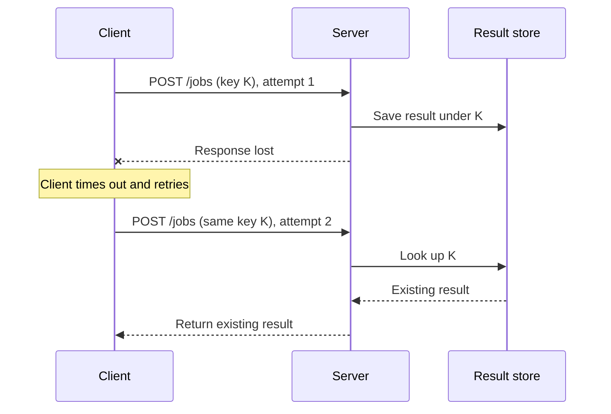

# Diagrams

Use this guide when relationships, boundaries, or execution paths are the main understanding gap.

## Select the diagram by the question

| Question | Diagram |
| --- | --- |
| Who calls whom, and in what order? | Sequence diagram |
| Which condition selects a path? | Flowchart |
| How does an object move between states? | State diagram |
| Where do components and ownership boundaries sit? | Architecture or component diagram |
| Which values or options differ? | Table or chart with explicit units |

Use Mermaid for small diagrams when the destination supports it. Use SVG or another supported renderer when precise layout or export matters. Use raster illustration for concepts that need it; keep labels and relationships checkable. If no renderer is available, provide editable diagram source and a text walkthrough, and say it has not been rendered.

## Preserve technical meaning

- Name nodes with actual components or clearly marked conceptual names.
- Label arrows with the operation, message, or data they carry.
- Show the direction and relevant order of flow.
- Separate observed behavior from proposed behavior with labels, not color alone.
- Include the failure branch that explains the developer's problem.
- Add a legend for non-obvious symbols and a caption that states the takeaway.
- Split crowded diagrams by question. Do not create a complete system map when one request path explains the issue.
- Put source pointers in nearby prose. Diagrams of a hypothesis must say so.

## Worked example

This is an illustrative policy, not a claim about a repository. The server processes attempt 1, but its response is lost:

**Takeaway:** Reusing an idempotency key lets the server return the original result after a lost response. Retrying alone does not prevent duplicate work. A real implementation also needs appropriate handling of concurrent requests with the same key.

## Verify

Trace a concrete input through the arrows and check it against the relevant code or logs. Render with the destination's supported syntax when possible. Inspect label readability and the main failure path. Add a short text equivalent for readers who cannot see the visual. If rendering or source verification is incomplete, say which check is missing.
